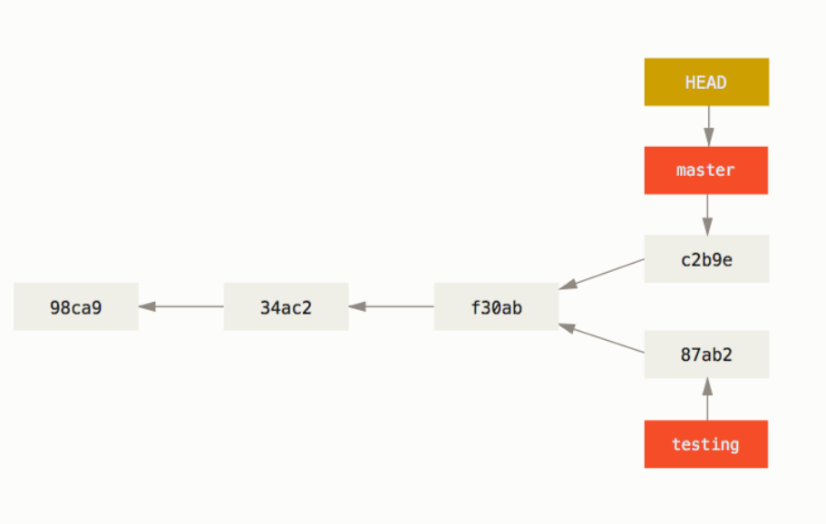

## git操作笔记

0. 使用git config配置全局环境  
    ```
    git config --global user.name "John Doe"  
    git config --global user.email johndoe@example.com 

    //查看所有的配置以及它们所在的文件
    git config --list --show-origin
    ```

1. ```git clone + url```，或者：  
  使用```git remote add <shortname> <url>```添加一个新的远程Git仓库，同时指定一个方便使用的简写，以便未来更方便地引用和操作该仓库（如推送和拉取代码）。然后就可以使用```git fetch <remote>```从指定的远程仓库获取最新的历史记录和数据，```<remote>```是远程仓库的名称，也即上面通过```git remote add```添加的```<shortname>```

2. 将文件夹在代码编辑器中打开，进行修改与编辑。  
  如在vscode、jetbrains等与github合作的软件中，可以直接在软件中暂存与推送。
  否则：
    - **单项目环境下(通过git clone抓取项目)**：先使用```git status```查看当前跟踪的本地仓库的状态，然后使用```git add```(跟踪单个文件并暂存)，然后使用```git commit```命令推送到服务器。  
    **或**```git commit -a```,直接暂存所有修改并推送到服务器。

    - **如果有多个本地分支与多个远程服务器**：在仓库文件夹下，先使用```git remote```与```git branch```命令，分别查看**该仓库所对应的的远程仓库服务器** 与 **本地仓库中的所有分支(带*的是当前分支)**，然后使用```git push <远程服务器名> <要推送的分支名>```将本地的某个分支的修改推送到某个远程服务器。  

3. 其他命令：
  > 如果想要查看某一个远程仓库的更多信息，可以使用 ```git remote show <remote>```命令。 如果想以一个特定的缩写名运行这个命令，例如 ```origin```，会得到像下面类似的信息：  
  ```
  $ git remote show origin
  * remote origin
  Fetch URL: https://github.com/schacon/ticgit
  Push  URL: https://github.com/schacon/ticgit
  HEAD branch: master
  Remote branches:
      master                               tracked
      dev-branch                           tracked
  Local branch configured for 'git pull':
      master merges with remote master
  Local ref configured for 'git push':
      master pushes to master (up to date)
  ```

  > 远程仓库的重命名与移除:  
  你可以运行 git remote rename 来修改一个远程仓库的简写名。 例如，想要将 pb 重命名为 paul，可以用 git remote rename 这样做：

  ```
  $ git remote rename pb paul
  $ git remote
  origin
  paul
  ```

  值得注意的是这同样也会修改你所有远程跟踪的分支名字。 那些过去引用 pb/master 的现在会引用 paul/master。

> 如果因为一些原因想要移除一个远程仓库——你已经从服务器上搬走了或不再想使用某一个特定的镜像了， 又或者某一个贡献者不再贡献了——可以使用 ```git remote remove``` 或 ```git remote rm``` ：

  ```
  $ git remote remove paul
  $ git remote
  origin
  ```

  一旦你使用这种方式删除了一个远程仓库，那么所有和这个远程仓库相关的远程跟踪分支以及配置信息也会一起被删除。

## 非常好用的分支(branch)

1. 使用git branch <分支名>创建分支。

2. 使用 git log --oneline --decorate 命令查看各个分支当前所指的对象，然后使用 git checkout <分支名>命令切换分支。在分支中的任何操作都不会影响到原分支，好厉害。这时就可以配合```git push <远程服务器名> <要推送的分支名>```命令非常灵活地操作版本更新与迭代了。



3. 使用 git log 命令查看分叉历史。 运行 git log --oneline --decorate --graph --all ，它会输出你的提交历史、各个分支的指向以及项目的分支分叉情况。
